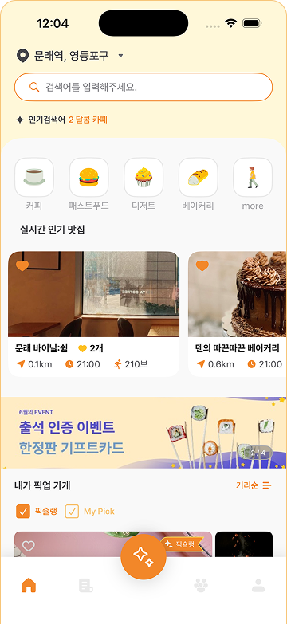
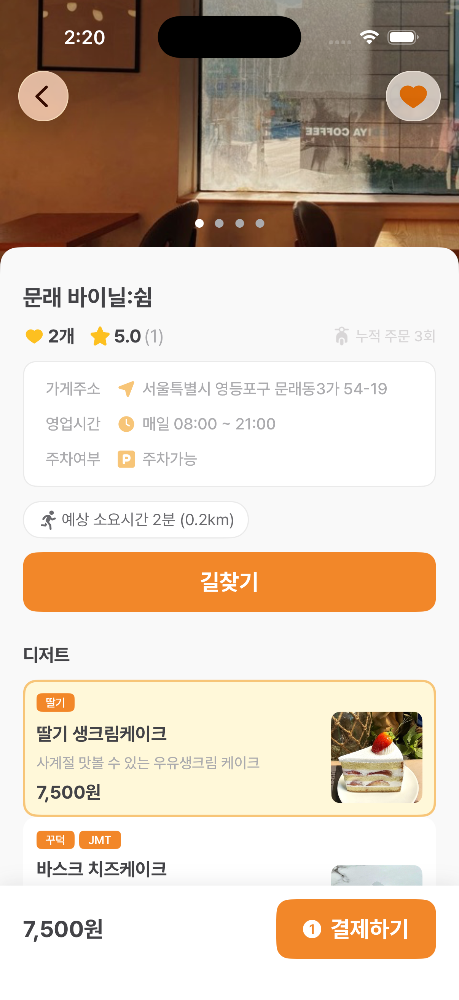
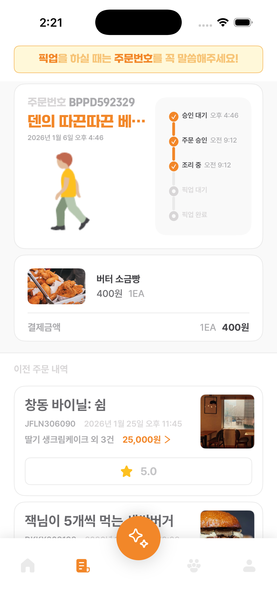
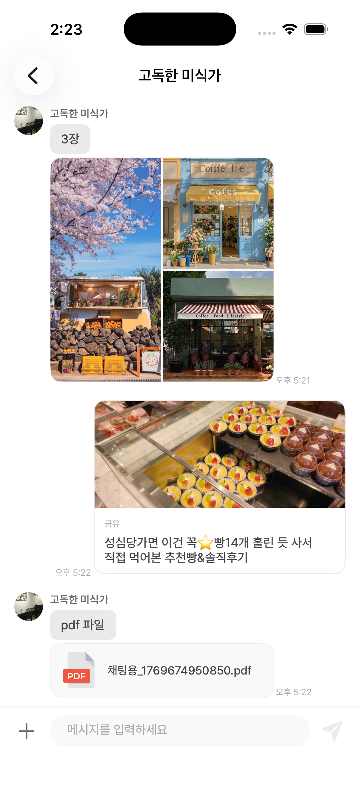
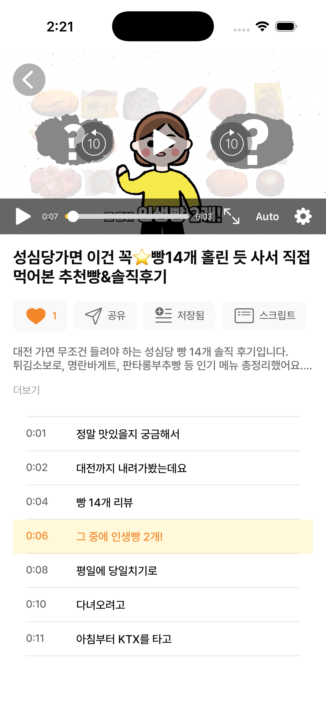
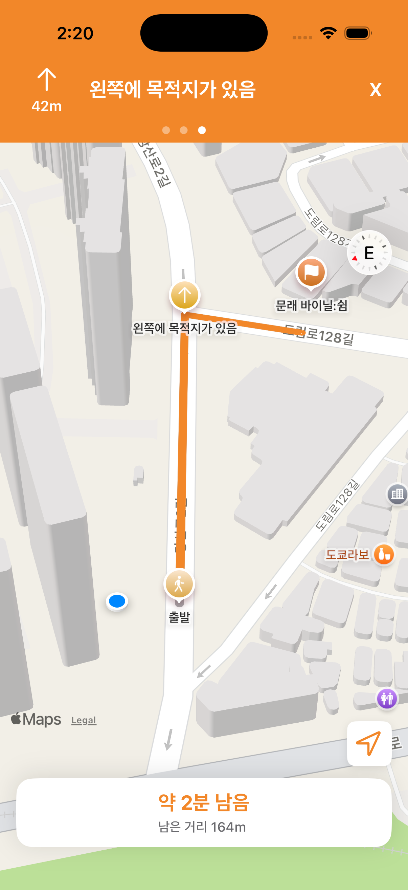
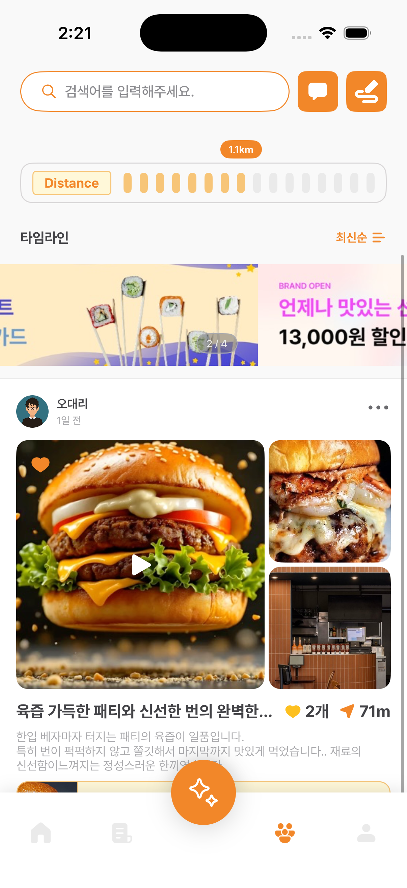
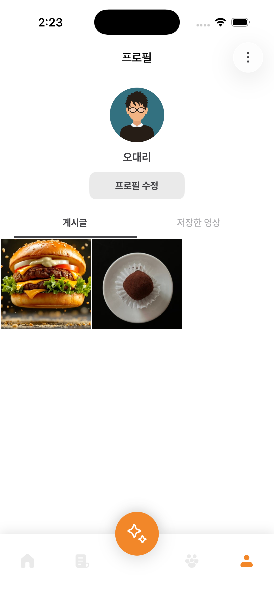
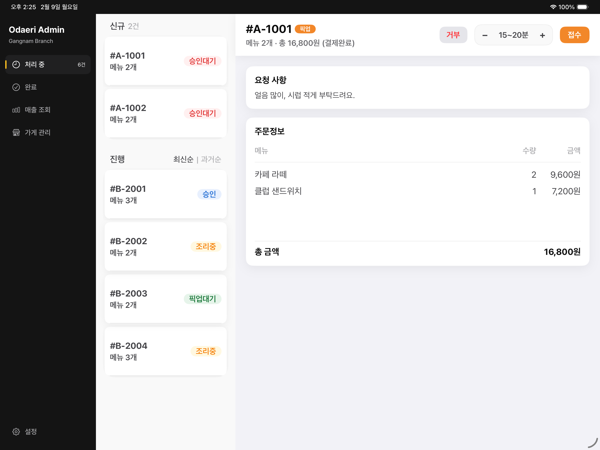
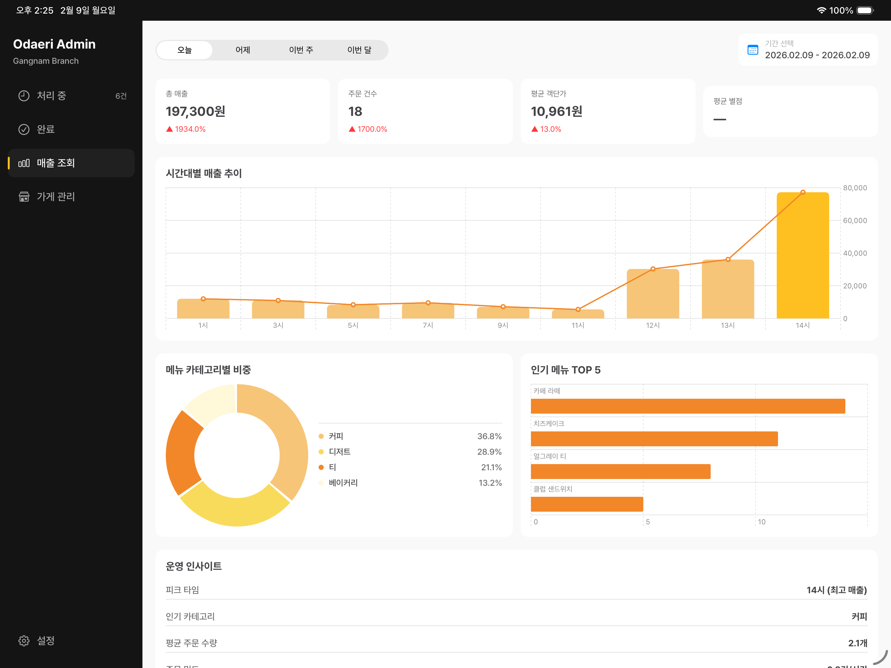

# Odaeri

**Tech Stack**
- `Swift`, `UIKit`, `Combine`
- `SnapKit`, `Moya`, `Alamofire`
- `Socket.IO`, `Firebase Messaging`, `Realm`
- `MapKit`, `ActivityKit`, `AVKit`, `WebKit`
- `KakaoSDK`, `AuthenticationServices`
- `SwiftUI`, `Swift Charts` (Admin Dashboard)

**프로젝트 개요**
Odaeri는 음식을 주문하고 픽업할 수 있는 iOS 앱입니다. 고객용 `Odaeri_User`와 관리자용 `Odaeri_Admin` 2개 타겟으로 구성되어 있습니다.

**타겟 구성**
- `Odaeri_User` (고객용)
- `iPhone`, iOS 17.0+
- Clean Architecture + MVVM-C
- `Odaeri_Admin` (관리자용)
- `iPad`, iPadOS 17.1+
- MVVM

**Odaeri_User 주요 기능 요약**
- 회원 인증 (이메일 로그인, 소셜 로그인, 회원가입)
- 홈/매장 (카테고리, 리스트, 검색)
- 매장 상세/메뉴 (상세 정보, 메뉴 구성)
- 결제 (PG 결제, 딥링크를 활용한 결제 플로우)
- 주문 상태 추적 (5단계 상태, Live Activity 연동)
- 1:1 채팅 (Socket.IO & REST 기반 실시간 메시지)
- 스트리밍 (HLS, PIP, 자막, 공유)
- 길찾기 (MapKit 기반 도보 경로, TTS 음성 안내)
- 커뮤니티 (게시글 등록/수정, 이미지 업로드)
- 리뷰 (별점/리뷰 작성, 이미지 첨부)
- 프로필 (작성글/저장 항목 관리, 내 정보)

**Odaeri_User 스크린샷**

| 홈 | 매장 상세 | 주문 목록 | 채팅 |
| --- | --- | --- | --- |
|   |   |   |   |

| 스트리밍 | 도보 길찾기 | 커뮤니티 | 프로필 |
| --- | --- | --- | --- |
|   |   |   |   |

**Odaeri_Admin 요약 (핵심 3가지)**
- 주문 상태 관리: 승인 대기부터 픽업 완료까지 5단계 주문 상태 관리
- 매장 및 메뉴 관리: 매장 정보와 메뉴 등록/수정
- 매출 분석 대시보드: Swift Charts 기반 일간/주간/월간 매출 추이 시각화

**Odaeri_Admin 스크린샷**

<table>
  <tr>
    <td width="50%" align="center">
      주문 현황 
      
    </td>
    <td width="50%" align="center">
      매출 현황 
      
    </td>
  </tr>
</table>

**아키텍처 요약**
- `Odaeri_User`: Clean Architecture + MVVM-C
- `Odaeri_Admin`: MVVM
- `Shared`: Network, Models, Utils 공유

**작업 내역 요약**
- 고객용/관리자용 전 기능 설계 및 구현
- Clean Architecture + MVVM-C 기반 모듈 구조 설계
- 공통 네트워크/모델/유틸 구조화
- 주문 Live Activity 및 스트리밍/채팅/길찾기 등 주요 기능 구현
